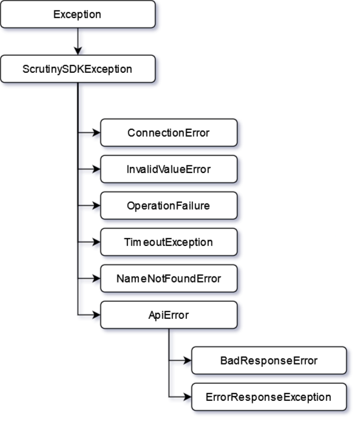

.. _page_exceptions:

Exceptions
==========

All exceptions thrown by the Scrutiny Python :abbr:`SDK (Software dEvelopment Kit)` inherits the common :class:`ScrutinySDKException<scrutiny.sdk.ScrutinySDKException>`.

The inheritance hierarchy goes as follow.

-----

.. autoclass:: scrutiny.sdk.exceptions.ScrutinySDKException

-----

.. autoclass:: scrutiny.sdk.exceptions.ConnectionError

-----

.. autoclass:: scrutiny.sdk.exceptions.InvalidValueError

-----

.. autoclass:: scrutiny.sdk.exceptions.OperationFailure

-----

.. autoclass:: scrutiny.sdk.exceptions.TimeoutException

-----

.. autoclass:: scrutiny.sdk.exceptions.NameNotFoundError

-----

.. autoclass:: scrutiny.sdk.exceptions.ApiError

-----

.. autoclass:: scrutiny.sdk.exceptions.BadResponseError

-----

.. autoclass:: scrutiny.sdk.exceptions.ErrorResponseException