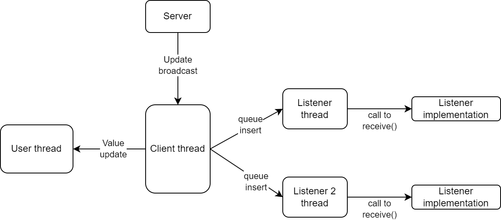

Listeners
=========

Introduction
------------

Synchronous access to watchables (variables, aliases, and :abbr:`RPVs (Runtime Published Value)`), as outlined in the 
:ref:`Accessing Variables<page_accessing_variables>` section, can be useful. 
However, it has certain limitations, especially when monitoring multiple values simultaneously.

For example, if one wants to log a list of watchables, it would required to continuously loop and monitor the 
:attr:`udpate_counter<scrutiny.sdk.watchable_handle.WatchableHandle.update_counter>` property to detect changes. 
However, this approach does not guarantee that all changes will be noticed by the user thread.
In addition to being unreliable, this technique will cause unnecessary CPU usage.

To address this issue, the :class:`Client<scrutiny.sdk.client.ScrutinyClient>` object can function as a `Notifier`. 
It informs a list of listeners when it receives a value update broadcast from the server.
Registering a listener is done through :meth:`register_listener<scrutiny.sdk.client.ScrutinyClient.register_listener>`

.. automethod:: scrutiny.sdk.client.ScrutinyClient.register_listener

-----

Using a listener
----------------

In order to use a listener, one must create it, register it to the client, subscribe to watchables elements with 
:meth:`subscribe()<scrutiny.sdk.listeners.BaseListener.subscribe>` and then start the listener.

.. automethod:: scrutiny.sdk.listeners.BaseListener.subscribe

It is possible to unsubscribe to watchables with one of the following method

.. automethod:: scrutiny.sdk.listeners.BaseListener.unsubscribe

-----

.. automethod:: scrutiny.sdk.listeners.BaseListener.unsubscribe_all

-----

.. automethod:: scrutiny.sdk.listeners.BaseListener.prune_subscriptions

Each listener has a :meth:`start()<scrutiny.sdk.listeners.BaseListener.start>` and a :meth:`stop()<scrutiny.sdk.listeners.BaseListener.stop>` method.
These methods launches an internal thread that will handle each new value updates. 

.. automethod:: scrutiny.sdk.listeners.BaseListener.start

-----

.. automethod:: scrutiny.sdk.listeners.BaseListener.stop

:meth:`start()<scrutiny.sdk.listeners.BaseListener.start>` can be used is a ``with`` statement like so

.. code-block:: python

    from scrutiny.sdk.client import ScrutinyClient
    from scrutiny.sdk.listeners.text_stream_listener import TextStreamListener
    import time

    client = ScrutinyClient()
    with client.connect('localhost', 1234):
        listener = TextStreamListener()     # TextStreamListener prints all updates to stdout by default
        client.register_listener(listener)  # Attach to the client

        some_var_1 = client.watch('/var/global/some_var')
        the_other_var = client.watch('/var/static/main.cpp/the_other_var')

        listener.subscribe([some_var_1, the_other_var]) # Tells the listener which watchable to listen for
        with listener.start():  # Start the listener
            # setup() has been called from the listener thread
            time.sleep(5)
        # teardown() has been called from the listener thread

        print("We are done")
    # Client is automatically disconnected

Listeners may or may not allow a user to add or remove watchables from their subscription list while the listener is active.
This behavior is controlled by overriding :meth:`allow_subcription_changes_while_running()<scrutiny.sdk.listeners.BaseListener.allow_subcription_changes_while_running>`.

Some listeners will allow it (like the :class:`TextStreamListener<scrutiny.sdk.listeners.TextStreamListener>` or the :class:`BufferedReaderListener<scrutiny.sdk.listeners.BufferedReaderListener>`) 
, but some does not (like the :class:`CSVFileListener<scrutiny.sdk.listeners.CSVFileListener>`). When not allowed, a :class:`NotAllowedError<scrutiny.sdk.exceptions.NotAllowedError>` will
be raised if one of the following method is called after :meth:`start()<scrutiny.sdk.listeners.BaseListener.start>` has been called.

- :meth:`subscribe()<scrutiny.sdk.listeners.BaseListener.subscribe>`
- :meth:`unsubscribe()<scrutiny.sdk.listeners.BaseListener.unsubscribe>`
- :meth:`unsubscribe_all()<scrutiny.sdk.listeners.BaseListener.unsubscribe_all>`
- :meth:`prune_subscriptions()<scrutiny.sdk.listeners.BaseListener.prune_subscriptions>`

.. automethod:: scrutiny.sdk.listeners.BaseListener.allow_subcription_changes_while_running

-----

Internal behavior
-----------------

A listener runs in a separate thread and awaits value updates by monitoring a python ``queue`` that is fed by the 
:class:`client<scrutiny.sdk.client.ScrutinyClient>` object. 
The Python ``queue`` object internally utilizes `condition variables`, which results in a scheduler switch between 
the notifier thread and the listner thread occurring in just microseconds.

When the update notification reaches the listener, they are forwarded to the listener-specific 
:meth:`receive()<scrutiny.sdk.listeners.BaseListener.receive>` method.

Once the user thread invokes the :meth:`start()<scrutiny.sdk.listeners.BaseListener.start>` method, the listener thread is launched
and the :meth:`setup()<scrutiny.sdk.listeners.BaseListener.setup>` method is called from within this new thread.

If :meth:`start()<scrutiny.sdk.listeners.BaseListener.start>` succeeds and :meth:`setup()<scrutiny.sdk.listeners.BaseListener.setup>` 
is correctly invoked, the :meth:`teardown()<scrutiny.sdk.listeners.BaseListener.teardown>` method is guaranteed to be invoked too, 
irrespective of whether an exception has been raised within the :meth:`setup()<scrutiny.sdk.listeners.BaseListener.setup>` 
or :meth:`receive()<scrutiny.sdk.listeners.BaseListener.receive>`.

The :meth:`teardown()<scrutiny.sdk.listeners.BaseListener.teardown>` is called from the listener thread if the user calls
:meth:`stop()<scrutiny.sdk.listeners.BaseListener.stop>` or if an exception occur during setup or while listening.

-----

Writing a Listener
------------------

To write a listener, one must create a class that inherits the :class:`BaseListener<scrutiny.sdk.listeners.BaseListener>` class and implements
the :meth:`receive()<scrutiny.sdk.listeners.BaseListener.receive>` method.  

.. autoclass:: scrutiny.sdk.listeners.BaseListener
    :exclude-members: __new__, setup, teardown, start, stop, receive, subscribe
    :members:
    :member-order: bysource

-----

.. automethod:: scrutiny.sdk.listeners.BaseListener.receive

-----

The element passed to :meth:`receive()<scrutiny.sdk.listeners.BaseListener.receive>` are immutable :class:`ValueUpdate<scrutiny.sdk.listeners.ValueUpdate>`
objects that represents the update content.

.. autoclass:: scrutiny.sdk.listeners.ValueUpdate
    :exclude-members: __new__, __init__
    :members:
    :member-order: bysource

-----

Two optional methods can be overriden to perform a :meth:`setup<scrutiny.sdk.listeners.BaseListener.setup>` and/or 
a :meth:`teardown<scrutiny.sdk.listeners.BaseListener.teardown>`. If not overriden, these 2 methods will do nothing by default.

.. automethod:: scrutiny.sdk.listeners.BaseListener.setup

-----

.. automethod:: scrutiny.sdk.listeners.BaseListener.teardown

-----

Performance statistics
----------------------

It is possible to get some interesting numbers about the performance of the listener using :meth:`get_stats()<scrutiny.sdk.listeners.BaseListener.get_stats>`

.. automethod:: scrutiny.sdk.listeners.BaseListener.get_stats 

-----

.. automethod:: scrutiny.sdk.listeners.BaseListener.reset_stats

-----

.. autoclass:: scrutiny.sdk.listeners.ListenerStatistics

-----

Available listeners
-------------------

There is a few listeners already available in the Scrutiny SDK.

TextStreamListener
##################

.. autoclass:: scrutiny.sdk.listeners.text_stream_listener.TextStreamListener
    :exclude-members: __new__

BufferedReaderListener
######################

.. autoclass:: scrutiny.sdk.listeners.buffered_reader_listener.BufferedReaderListener
    :exclude-members: __new__
    :members: get_queue

CSVFileListener
###############

.. autoclass:: scrutiny.sdk.listeners.csv_file_listener.CSVFileListener
    :exclude-members: __new__

-----

.. autoclass:: scrutiny.sdk.listeners.csv_file_listener.CSVConfig 
    :exclude-members: __new__, __init__
    :members:
    :member-order: bysource
